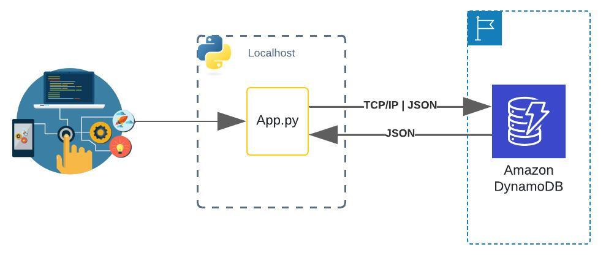

## Introduction 


### DynamoDB

DynamoDB is a fully managed NoSQL database service provided by Amazon Web Services (AWS). It is designed to handle large amounts of data and provides fast and predictable performance with seamless scalability.

- **Managed Service:** DynamoDB is fully managed, meaning that AWS handles operational tasks such as hardware provisioning, setup, configuration, and backups.

- **NoSQL Database:** It is a NoSQL database, allowing for flexible data models and horizontal scaling, making it suitable for applications with varying data structures.

- **Performance:** DynamoDB offers single-digit millisecond response times, ideal for applications that require high-speed data access.

- **Scalability:** The service can automatically scale up and down to accommodate varying workloads, allowing applications to handle large volumes of data and traffic without manual intervention.

- **Global Tables:** DynamoDB supports global tables, enabling multi-region, fully replicated tables that provide low-latency access to data across different geographical locations.

- **Integration with AWS Services:** DynamoDB integrates seamlessly with other AWS services such as Lambda, API Gateway, and S3, allowing for the development of complex applications in the cloud.

- **Security and Compliance:** It provides built-in security features, including encryption at rest and in transit, and supports AWS Identity and Access Management (IAM) for fine-grained access control.

- **Code Example:** Below is a simple Python code snippet demonstrating how to interact with DynamoDB using the `boto3` library to create a table and add an item.

- Here we have the compiled code and the generated graphics.
### Code Example

Below is a simple Python code snippet demonstrating how to interact with DynamoDB using the `boto3` library to create a table and add an item.

```python
import boto3

# Initialize a session using Amazon DynamoDB
session = boto3.Session(
    aws_access_key_id='YOUR_ACCESS_KEY',
    aws_secret_access_key='YOUR_SECRET_KEY',
    region_name='us-west-2'  # Change to your region
)

# Initialize DynamoDB resource
dynamodb = session.resource('dynamodb')

# Create a new table
table = dynamodb.create_table(
    TableName='MyTable',
    KeySchema=[
        {
            'AttributeName': 'id',
            'KeyType': 'HASH'  # Partition key
        }
    ],
    AttributeDefinitions=[
        {
            'AttributeName': 'id',
            'AttributeType': 'S'  # String type
        }
    ],
    ProvisionedThroughput={
        'ReadCapacityUnits': 5,
        'WriteCapacityUnits': 5
    }
)

# Wait until the table exists
table.meta.client.get_waiter('table_exists').wait(TableName='MyTable')

print("Table created successfully!")

# Add an item to the table
table.put_item(
    Item={
        'id': '123',
        'name': 'Sample Item',
        'description': 'This is a sample item.'
    }
)

